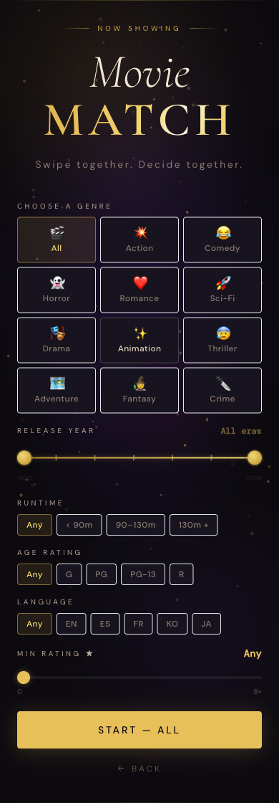
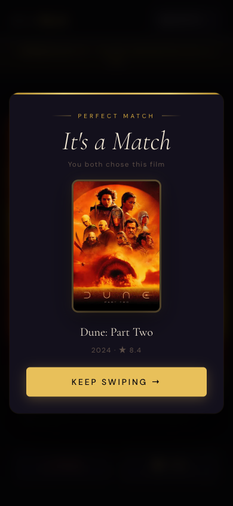

# MovieMatch

A real-time two-player movie swiping app. Both people swipe through movies simultaneously — when you both like the same one, it's a match.

---

## Code Explanation

Interactive line-by-line walkthrough of every file, function, and design decision.

**[shaiaviv.github.io/movie-match](https://shaiaviv.github.io/movie-match/)**

| Page | What it covers |
|---|---|
| [Hub](https://shaiaviv.github.io/movie-match/index.html) | Project overview, runtime flow, quick function reference |
| [Code Walkthrough](https://shaiaviv.github.io/movie-match/code-walkthrough.html) | Every file and function annotated line by line |
| [Architecture](https://shaiaviv.github.io/movie-match/architecture.html) | Component map, socket events, call graph, tech decisions |
| [Interview Prep](https://shaiaviv.github.io/movie-match/interview-prep.html) | 15 likely interview questions with full answers and code gotchas |
| [Deep Dive: roomManager](https://shaiaviv.github.io/movie-match/deep-dive-roommanager.html) | Match detection algorithm, edge cases, and data structure breakdown |


---

## How It Works

1. One person creates a room and applies filters (genre, year, runtime, rating, language, age rating)
2. They share the 6-letter room code — or just paste the full link
3. Both swipe through the same 20 movies at their own pace
4. When both swipe right on the same movie — match!

---

## Screenshots

**Home**


**Filters & Room Setup**



**Join a Room**


**Swiping**


**It's a Match**



---

## Tech Stack

| Layer | Tech |
|---|---|
| Frontend | React 18, Vite, Tailwind CSS |
| Backend | Node.js, Express, Socket.io |
| Movies API | TMDB (The Movie Database) |
| Deployment | Railway (backend) + Vercel (frontend) |

---

## Running Locally

### Prerequisites

- Node.js 18+
- A free [TMDB API key](https://www.themoviedb.org/settings/api)

### 1. Clone the repo

```bash
git clone https://github.com/shaiaviv/movie-match.git
cd movie-match
```

### 2. Set up environment variables

```bash
cp .env.example server/.env
```

Edit `server/.env` and add your TMDB key:

```
TMDB_API_KEY=your_api_key_here
```

### 3. Install dependencies

```bash
# Root (for the dev script)
npm install

# Server
npm install --prefix server

# Client
npm install --prefix client
```

### 4. Start both servers

```bash
npm run dev
```

This starts both the backend (`http://localhost:3001`) and frontend (`http://localhost:5173`) in one command with color-coded output.

To test the full two-player experience, open `http://localhost:5173` in **two browser tabs** — one creates a room, the other joins with the code.

---

## Project Structure

```
movie-match/
├── client/               # React frontend
│   └── src/
│       ├── components/
│       │   ├── MovieCard.jsx    # Swipe gestures, card stack, 3D tilt
│       │   └── MatchModal.jsx   # Match celebration popup with confetti
│       └── pages/
│           ├── Home.jsx         # Room creation (with filters) / join
│           └── Room.jsx         # Main swiping screen
│
├── server/               # Node.js backend
│   ├── index.js          # Express + Socket.io server
│   ├── roomManager.js    # Room state + vote/match logic
│   └── tmdb.js           # TMDB API wrapper with filter support
│
├── package.json          # Root — `npm run dev` starts both
├── railway.json          # Railway deployment config
└── .env.example          # Environment variable template
```

---

## Filters

When creating a room you can narrow down the movie pool with:

| Filter | Options |
|---|---|
| Genre | All, Action, Comedy, Horror, Romance, Sci-Fi, Drama, Animation, Thriller, Adventure, Fantasy, Crime |
| Release Year | Dual-handle slider — 1900 to present |
| Runtime | Any / < 90m / 90–130m / 130m+ |
| Age Rating | Any / G / PG / PG-13 / R |
| Language | Any / EN / ES / FR / KO / JA |
| Min Rating | Slider from 0 to 8+ (TMDB vote average) |

All filters are forwarded to TMDB's Discover API on the server.

---

## Swiping

Cards support both touch (mobile) and mouse (desktop):

- **Drag right** → Like
- **Drag left** → Pass
- **Quick flick** → Registers as a swipe even if short
- **Buttons** → Tap Pass or Yes for the same effect with animation
- **Card stack** → Ghost cards behind the current card scale forward as you drag, showing what's coming next

A match is detected the moment both players have liked the same movie. A confetti-burst modal appears for both players simultaneously.

---

## Joining

The second player can join by:

- Entering the **6-letter room code** directly
- Pasting the **full room link** (e.g. `https://your-app.com/room/ABCXYZ`)
- Navigating directly to the room URL

---

## Deployment

The backend and frontend are deployed separately.

### Backend — Railway

The repo includes a `railway.json` that configures everything automatically.

1. Push your repo to GitHub
2. Create a new project on [Railway](https://railway.app)
3. Connect your GitHub repo — Railway picks up `railway.json` automatically
4. Add the environment variable: `TMDB_API_KEY=your_key`
5. Deploy — Railway gives you a public URL like `https://movie-match-server.up.railway.app`

### Frontend — Vercel (via GitHub Actions)

The repo includes a GitHub Actions workflow (`.github/workflows/deploy.yml`) that deploys to Vercel on every push to `main`.

Set these secrets in your GitHub repo settings:

- `VERCEL_TOKEN`
- `VERCEL_ORG_ID`
- `VERCEL_PROJECT_ID`
- `VITE_SERVER_URL` — your Railway backend URL

#### Manual deploy

```bash
cd client
npx vercel --prod
```

---

## Environment Variables

| Variable | Required | Description |
|---|---|---|
| `TMDB_API_KEY` | Yes | Your TMDB v3 API key — get one free at [themoviedb.org](https://www.themoviedb.org/settings/api) |
| `PORT` | No | Server port (defaults to `3001`) |
| `VITE_SERVER_URL` | No | Points the frontend build at a deployed backend URL |

---

## License

MIT
