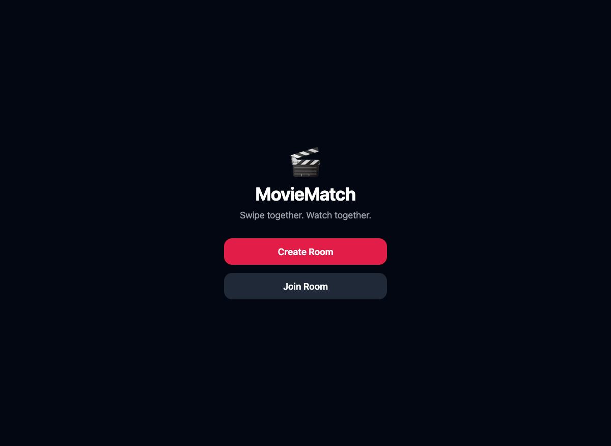
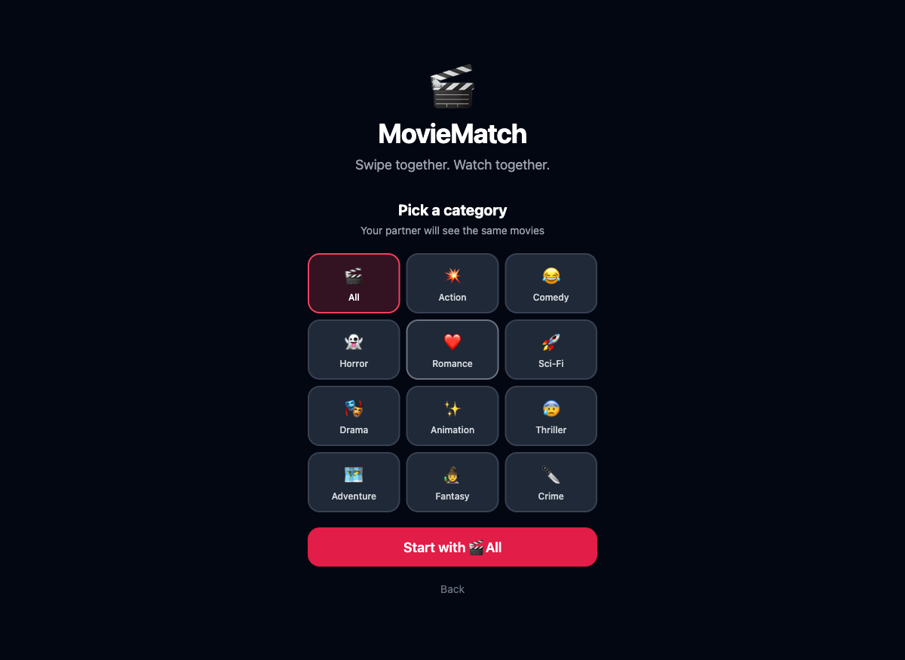
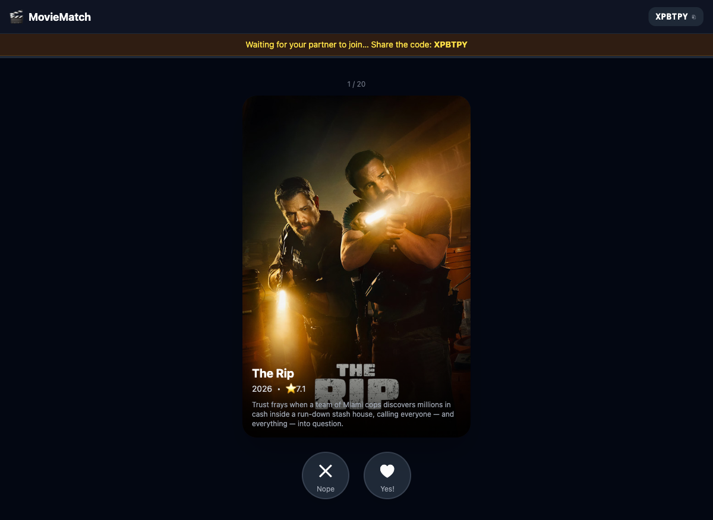
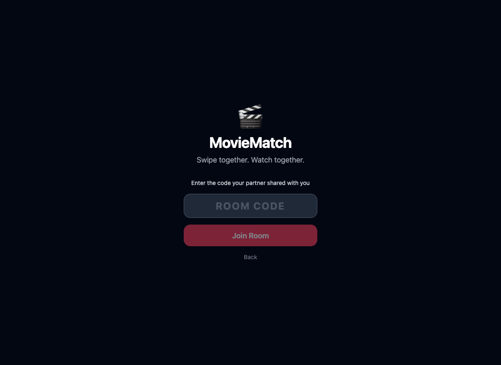

# MovieMatch

A real-time two-player movie swiping app. Both people swipe through movies simultaneously — when you both like the same one, it's a match.



---

## How It Works

1. One person creates a room and picks a genre
2. They share the 6-letter room code with their partner
3. Both swipe through the same 20 movies at their own pace
4. When both swipe right on the same movie — match!

---

## Screenshots

**Home**


**Pick a Category**



**Swiping**



**Join a Room**



---

## Tech Stack

| Layer | Tech |
|---|---|
| Frontend | React 18, Vite, Tailwind CSS |
| Backend | Node.js, Express, Socket.io |
| Movies API | TMDB (The Movie Database) |
| Deployment | Railway (backend) + any static host (frontend) |

---

## Running Locally

### Prerequisites

- Node.js 18+
- A free [TMDB API key](https://www.themoviedb.org/settings/api)

### 1. Clone the repo

```bash
git clone https://github.com/shaiaviv/movie-match.git
cd movie-match
```

### 2. Set up environment variables

```bash
cp .env.example server/.env
```

Edit `server/.env` and add your TMDB key:

```
TMDB_API_KEY=your_api_key_here
```

### 3. Install dependencies

```bash
# Root (for the dev script)
npm install

# Server
npm install --prefix server

# Client
npm install --prefix client
```

### 4. Start both servers

```bash
npm run dev
```

This starts both the backend (`http://localhost:3001`) and frontend (`http://localhost:5173`) in one command with color-coded output.

To test the full two-player experience, open `http://localhost:5173` in **two browser tabs** — one creates a room, the other joins with the code.

---

## Project Structure

```
movie-match/
├── client/               # React frontend
│   └── src/
│       ├── components/
│       │   ├── MovieCard.jsx    # Swipe gestures + card UI
│       │   └── MatchModal.jsx   # Match celebration popup
│       └── pages/
│           ├── Home.jsx         # Room creation / join
│           └── Room.jsx         # Main swiping screen
│
├── server/               # Node.js backend
│   ├── index.js          # Express + Socket.io server
│   ├── roomManager.js    # Room state + vote/match logic
│   └── tmdb.js           # TMDB API wrapper
│
├── package.json          # Root — `npm run dev` starts both
├── railway.json          # Railway deployment config
└── .env.example          # Environment variable template
```

---

## Swiping

Cards support both touch (mobile) and mouse (desktop):

- **Drag right** → Like
- **Drag left** → Nope
- **Quick flick** → Registers as a swipe even if short
- **Buttons** → Tap ✕ or ♥ for the same effect with animation

A match is detected the moment both players have liked the same movie.

---

## Deployment

The backend and frontend are deployed separately.

### Backend — Railway

The repo includes a `railway.json` that configures everything automatically.

1. Push your repo to GitHub
2. Create a new project on [Railway](https://railway.app)
3. Connect your GitHub repo — Railway picks up `railway.json` automatically
4. Add the environment variable: `TMDB_API_KEY=your_key`
5. Deploy — Railway gives you a public URL like `https://movie-match-server.up.railway.app`

### Frontend — Static Host (Vercel / Netlify / Railway)

The client is a plain Vite build. Point it at your backend URL before building:

1. In `client/src/socket.js`, set the server URL to your Railway backend URL
2. Build: `npm run build --prefix client`
3. Deploy the `client/dist/` folder to Vercel, Netlify, or any static host

#### Vercel (one-click)

```bash
cd client
npx vercel --prod
```

#### Netlify

```bash
cd client
npm run build
npx netlify deploy --prod --dir dist
```

---

## Environment Variables

| Variable | Required | Description |
|---|---|---|
| `TMDB_API_KEY` | Yes | Your TMDB v3 API key — get one free at [themoviedb.org](https://www.themoviedb.org/settings/api) |
| `PORT` | No | Server port (defaults to `3001`) |

---

## License

MIT
